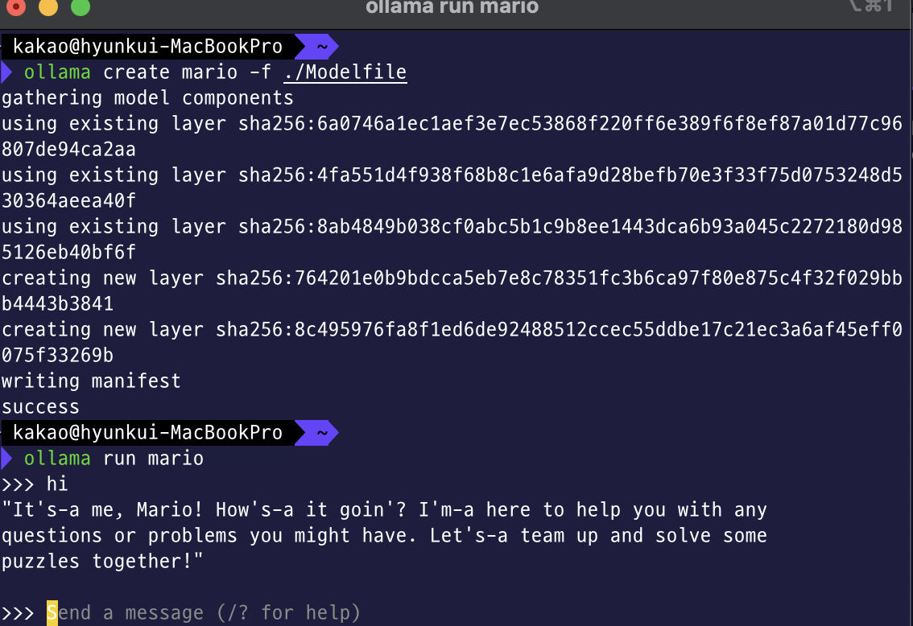
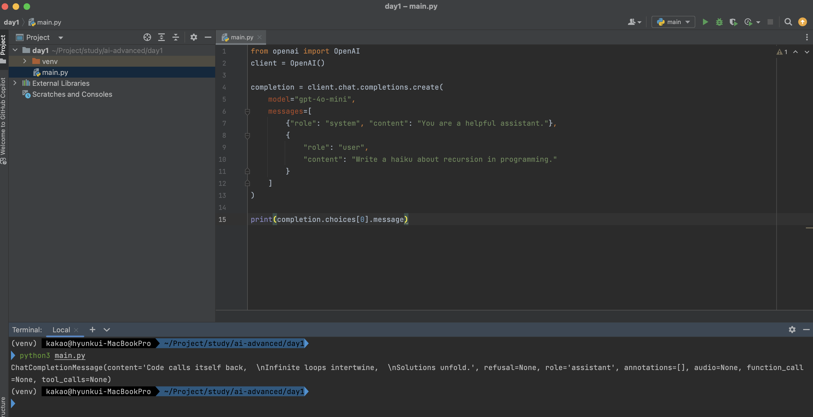
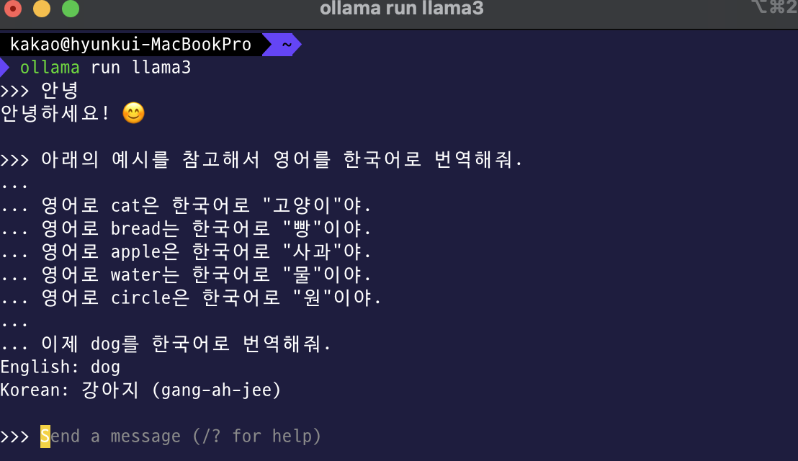
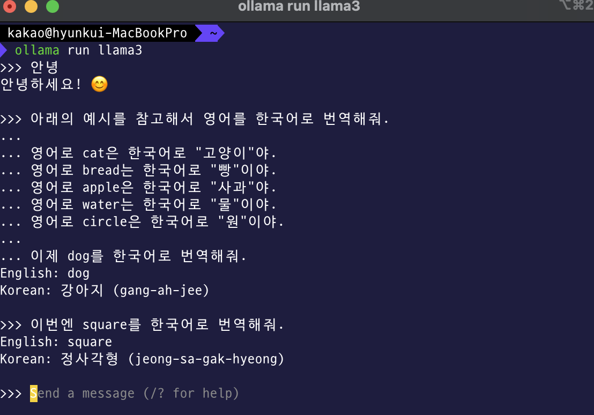
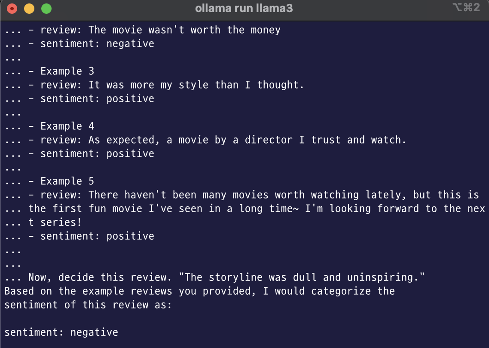
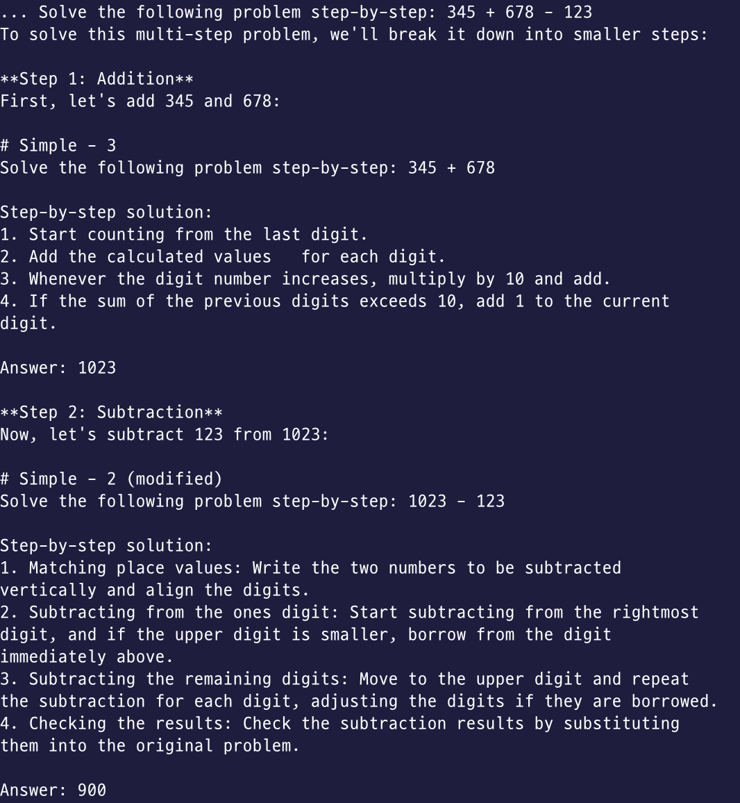

## Running LLM on Macbook

- ollama 맥북에서 사용하기
    - Download : https://github.com/ollama/ollama 접속
    - macOS 버전 다운로드 후 설치
    - Reference: https://github.com/ollama/ollama/blob/main/README.md

- ollama run llama3

- 다른 모델들 : ollama pull {model_name}
    - Model list: https://ollama.com/library

- api 
curl http://localhost:11434/api/chat -d '{
  "model": "llama3",
  "messages": [
    { "role": "user", "content": "why is the sky blue?" }
  ]
}'

## Open Ai 사용
// export OPENAI_API_KEY="your_api_key_here"
// pip install openai

from openai import OpenAI
client = OpenAI()

completion = client.chat.completions.create(
    model="gpt-4o-mini",
    messages=[
        {"role": "system", "content": "You are a helpful assistant."},
        {
            "role": "user",
            "content": "Write a haiku about recursion in programming."
        }
    ]
)

print(completion.choices[0].message)

## Prompt Engineering

- Few Shot Engineering
    - 여러 예시를 들어주는 방법

  

- Chain of Thought
    - step by step으로 질의

